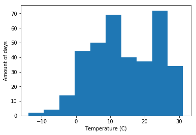
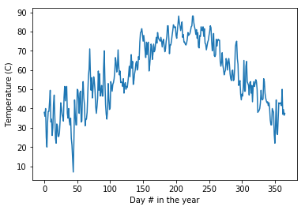
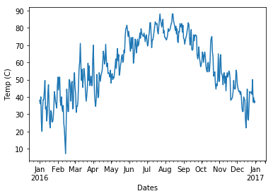

## Basic data exploration with pandas


```python
import pandas as pd # the pd is by convention
import numpy as np # also convention
```

We will use a practice dataset containing weather data measured in Central Park NYC, obtained from [Kaggle](https://www.kaggle.com/mathijs/weather-data-in-new-york-city-2016). The data is added to this repo. 


```python
# load csv data
weather = pd.read_csv('CP2016.csv')

# check first 5 rows
weather.head()
```

<table border="1" class="dataframe">
  <thead>
    <tr style="text-align: right;">
      <th></th>
      <th>date</th>
      <th>maximum temperature</th>
      <th>minimum temperature</th>
      <th>average temperature</th>
      <th>precipitation</th>
      <th>snow fall</th>
      <th>snow depth</th>
    </tr>
  </thead>
  <tbody>
    <tr>
      <th>0</th>
      <td>1-1-2016</td>
      <td>42</td>
      <td>34</td>
      <td>38.0</td>
      <td>0.00</td>
      <td>0.0</td>
      <td>0</td>
    </tr>
    <tr>
      <th>1</th>
      <td>2-1-2016</td>
      <td>40</td>
      <td>32</td>
      <td>36.0</td>
      <td>0.00</td>
      <td>0.0</td>
      <td>0</td>
    </tr>
    <tr>
      <th>2</th>
      <td>3-1-2016</td>
      <td>45</td>
      <td>35</td>
      <td>40.0</td>
      <td>0.00</td>
      <td>0.0</td>
      <td>0</td>
    </tr>
    <tr>
      <th>3</th>
      <td>4-1-2016</td>
      <td>36</td>
      <td>14</td>
      <td>25.0</td>
      <td>0.00</td>
      <td>0.0</td>
      <td>0</td>
    </tr>
    <tr>
      <th>4</th>
      <td>5-1-2016</td>
      <td>29</td>
      <td>11</td>
      <td>20.0</td>
      <td>0.00</td>
      <td>0.0</td>
      <td>0</td>
    </tr>
  </tbody>
</table>
</div>


```python
# check out last 5 rows
weather.tail()
```


<table border="1" class="dataframe">
  <thead>
    <tr style="text-align: right;">
      <th></th>
      <th>date</th>
      <th>maximum temperature</th>
      <th>minimum temperature</th>
      <th>average temperature</th>
      <th>precipitation</th>
      <th>snow fall</th>
      <th>snow depth</th>
    </tr>
  </thead>
  <tbody>
    <tr>
      <th>361</th>
      <td>27-12-2016</td>
      <td>60</td>
      <td>40</td>
      <td>50.0</td>
      <td>0</td>
      <td>0</td>
      <td>0</td>
    </tr>
    <tr>
      <th>362</th>
      <td>28-12-2016</td>
      <td>40</td>
      <td>34</td>
      <td>37.0</td>
      <td>0</td>
      <td>0</td>
      <td>0</td>
    </tr>
    <tr>
      <th>363</th>
      <td>29-12-2016</td>
      <td>46</td>
      <td>33</td>
      <td>39.5</td>
      <td>0.39</td>
      <td>0</td>
      <td>0</td>
    </tr>
    <tr>
      <th>364</th>
      <td>30-12-2016</td>
      <td>40</td>
      <td>33</td>
      <td>36.5</td>
      <td>0.01</td>
      <td>T</td>
      <td>0</td>
    </tr>
    <tr>
      <th>365</th>
      <td>31-12-2016</td>
      <td>44</td>
      <td>31</td>
      <td>37.5</td>
      <td>0</td>
      <td>0</td>
      <td>0</td>
    </tr>
  </tbody>
</table>
</div>


Let's use more basic checks to check how the data looks like.


```python
# this gets the number of rows, and number of columns
weather.shape
```


    (366, 7)


Indeed, 365 days long plus the column names on the top, makes 366 rows.

And 7 columns.


```python
# get technical info
weather.info()
```

    <class 'pandas.core.frame.DataFrame'>
    RangeIndex: 366 entries, 0 to 365
    Data columns (total 7 columns):
    date                   366 non-null object
    maximum temperature    366 non-null int64
    minimum temperature    366 non-null int64
    average temperature    366 non-null float64
    precipitation          366 non-null object
    snow fall              366 non-null object
    snow depth             366 non-null object
    dtypes: float64(1), int64(2), object(4)
    memory usage: 20.1+ KB


Here we see the data types in the data set.

### Simple stats


```python
# get the mean for one column
weather['average temperature'].mean()
```


    57.21584699453552


```python
# get mininum for one column
weather['average temperature'].min()
```


    7.0


```python
# get max for one column
weather['average temperature'].max()
```


    88.5


```python
# get all basic statistics
weather.describe()
```


<table border="1" class="dataframe">
  <thead>
    <tr style="text-align: right;">
      <th></th>
      <th>maximum temperature</th>
      <th>minimum temperature</th>
      <th>average temperature</th>
    </tr>
  </thead>
  <tbody>
    <tr>
      <th>count</th>
      <td>366.000000</td>
      <td>366.000000</td>
      <td>366.000000</td>
    </tr>
    <tr>
      <th>mean</th>
      <td>64.625683</td>
      <td>49.806011</td>
      <td>57.215847</td>
    </tr>
    <tr>
      <th>std</th>
      <td>18.041787</td>
      <td>16.570747</td>
      <td>17.124760</td>
    </tr>
    <tr>
      <th>min</th>
      <td>15.000000</td>
      <td>-1.000000</td>
      <td>7.000000</td>
    </tr>
    <tr>
      <th>25%</th>
      <td>50.000000</td>
      <td>37.250000</td>
      <td>44.000000</td>
    </tr>
    <tr>
      <th>50%</th>
      <td>64.500000</td>
      <td>48.000000</td>
      <td>55.750000</td>
    </tr>
    <tr>
      <th>75%</th>
      <td>81.000000</td>
      <td>65.000000</td>
      <td>73.500000</td>
    </tr>
    <tr>
      <th>max</th>
      <td>96.000000</td>
      <td>81.000000</td>
      <td>88.500000</td>
    </tr>
  </tbody>
</table>
</div>


Note that we had 7 columns, so 4 columns are missing here. Why is that? 

Looking at the *technical info* in the cell above the basic statistics, we see that 3 rows have at least one **"non-null object"** instead of only numerical data (which would be **int** or **float** in python). 


### Selections


```python
# We already did this: selecting one column, print the first 5 rows
weather['maximum temperature'].head()
```


    0    42
    1    40
    2    45
    3    36
    4    29
    Name: maximum temperature, dtype: int64


```python
# check the different values for the snow fall variable. 
weather['snow fall'].value_counts()
```


    0       179
    0.0     162
    T        15
    0.4       3
    0.1       1
    2.8       1
    0.5       1
    1.4       1
    27.3      1
    2.5       1
    0.2       1
    Name: snow fall, dtype: int64


We see most days had 0 snow (179 days).

Btw, the  **T** in the data refers to "Trace", it means some precipitation or snow was registered, but not enough for a value. See the source description on [Kaggle](https://www.kaggle.com/mathijs/weather-data-in-new-york-city-2016). 


```python
# get the data for the first row, index 0.
weather.iloc[0]
```


    date                   1-1-2016
    maximum temperature          42
    minimum temperature          34
    average temperature          38
    precipitation              0.00
    snow fall                   0.0
    snow depth                    0
    Name: 0, dtype: object


```python
# get multiple rows based on the index location
weather.iloc[10:13]
```


<table border="1" class="dataframe">
  <thead>
    <tr style="text-align: right;">
      <th></th>
      <th>date</th>
      <th>maximum temperature</th>
      <th>minimum temperature</th>
      <th>average temperature</th>
      <th>precipitation</th>
      <th>snow fall</th>
      <th>snow depth</th>
    </tr>
  </thead>
  <tbody>
    <tr>
      <th>10</th>
      <td>11-1-2016</td>
      <td>40</td>
      <td>26</td>
      <td>33.0</td>
      <td>0.00</td>
      <td>0.0</td>
      <td>0</td>
    </tr>
    <tr>
      <th>11</th>
      <td>12-1-2016</td>
      <td>44</td>
      <td>25</td>
      <td>34.5</td>
      <td>0.00</td>
      <td>T</td>
      <td>0</td>
    </tr>
    <tr>
      <th>12</th>
      <td>13-1-2016</td>
      <td>30</td>
      <td>22</td>
      <td>26.0</td>
      <td>0.00</td>
      <td>0.0</td>
      <td>0</td>
    </tr>
  </tbody>
</table>
</div>


So **iloc** is used for selections based on **index** number, see the **i** in iloc.


```python
# Checkout selection of two columns for better overview
weather[['date','average temperature']].head()
```


<table border="1" class="dataframe">
  <thead>
    <tr style="text-align: right;">
      <th></th>
      <th>date</th>
      <th>average temperature</th>
    </tr>
  </thead>
  <tbody>
    <tr>
      <th>0</th>
      <td>1-1-2016</td>
      <td>38.0</td>
    </tr>
    <tr>
      <th>1</th>
      <td>2-1-2016</td>
      <td>36.0</td>
    </tr>
    <tr>
      <th>2</th>
      <td>3-1-2016</td>
      <td>40.0</td>
    </tr>
    <tr>
      <th>3</th>
      <td>4-1-2016</td>
      <td>25.0</td>
    </tr>
    <tr>
      <th>4</th>
      <td>5-1-2016</td>
      <td>20.0</td>
    </tr>
  </tbody>
</table>


What if we want to select specfic columns, based on their name instead of index location? You would use **loc** instead of **iloc**.

Hereunder, we use **loc** first indicate the rows, then the columns.


```python
# Checkout selection of 6 rows, 2 columns
weather.loc[3:8, ['date','average temperature']]
```


<table border="1" class="dataframe">
  <thead>
    <tr style="text-align: right;">
      <th></th>
      <th>date</th>
      <th>average temperature</th>
    </tr>
  </thead>
  <tbody>
    <tr>
      <th>3</th>
      <td>4-1-2016</td>
      <td>25.0</td>
    </tr>
    <tr>
      <th>4</th>
      <td>5-1-2016</td>
      <td>20.0</td>
    </tr>
    <tr>
      <th>5</th>
      <td>6-1-2016</td>
      <td>33.0</td>
    </tr>
    <tr>
      <th>6</th>
      <td>7-1-2016</td>
      <td>38.5</td>
    </tr>
    <tr>
      <th>7</th>
      <td>8-1-2016</td>
      <td>38.5</td>
    </tr>
    <tr>
      <th>8</th>
      <td>9-1-2016</td>
      <td>43.5</td>
    </tr>
  </tbody>
</table>


```python
# we can also use the loc to select specific data points based on a certain condition:
weather.loc[(weather['average temperature'] > 85)]
```


<table border="1" class="dataframe">
  <thead>
    <tr style="text-align: right;">
      <th></th>
      <th>date</th>
      <th>maximum temperature</th>
      <th>minimum temperature</th>
      <th>average temperature</th>
      <th>precipitation</th>
      <th>snow fall</th>
      <th>snow depth</th>
    </tr>
  </thead>
  <tbody>
    <tr>
      <th>204</th>
      <td>23-7-2016</td>
      <td>96</td>
      <td>80</td>
      <td>88.0</td>
      <td>0</td>
      <td>0</td>
      <td>0</td>
    </tr>
    <tr>
      <th>225</th>
      <td>13-8-2016</td>
      <td>96</td>
      <td>81</td>
      <td>88.5</td>
      <td>0</td>
      <td>0</td>
      <td>0</td>
    </tr>
    <tr>
      <th>226</th>
      <td>14-8-2016</td>
      <td>94</td>
      <td>78</td>
      <td>86.0</td>
      <td>0.06</td>
      <td>0</td>
      <td>0</td>
    </tr>
  </tbody>
</table>


```python
# if we dont want the all the columns, but focus on that column:
weather.loc[(weather['average temperature'] > 85), ['average temperature']]
```


<table border="1" class="dataframe">
  <thead>
    <tr style="text-align: right;">
      <th></th>
      <th>average temperature</th>
    </tr>
  </thead>
  <tbody>
    <tr>
      <th>204</th>
      <td>88.0</td>
    </tr>
    <tr>
      <th>225</th>
      <td>88.5</td>
    </tr>
    <tr>
      <th>226</th>
      <td>86.0</td>
    </tr>
  </tbody>
</table>


```python
# we can also change these values, if needed, like so:
weather.loc[(weather['average temperature'] > 85), ['average temperature']] = 88.1
```


```python
# lets check how these 2 data points were overwritten:
weather.loc[(weather['average temperature'] > 85), ['average temperature']]
```


<table border="1" class="dataframe">
  <thead>
    <tr style="text-align: right;">
      <th></th>
      <th>average temperature</th>
    </tr>
  </thead>
  <tbody>
    <tr>
      <th>204</th>
      <td>88.1</td>
    </tr>
    <tr>
      <th>225</th>
      <td>88.1</td>
    </tr>
    <tr>
      <th>226</th>
      <td>88.1</td>
    </tr>
  </tbody>
</table>


Hereunder there are 3 ways to make the same sub-selection in the data.


```python
# One way to select all rows with temp below 25 is by creating a "filter variable":
coldDays = (weather['average temperature'] < 25.0)
```


```python
weather[coldDays]
```


<table border="1" class="dataframe">
  <thead>
    <tr style="text-align: right;">
      <th></th>
      <th>date</th>
      <th>maximum temperature</th>
      <th>minimum temperature</th>
      <th>average temperature</th>
      <th>precipitation</th>
      <th>snow fall</th>
      <th>snow depth</th>
    </tr>
  </thead>
  <tbody>
    <tr>
      <th>4</th>
      <td>5-1-2016</td>
      <td>29</td>
      <td>11</td>
      <td>20.0</td>
      <td>0.00</td>
      <td>0.0</td>
      <td>0</td>
    </tr>
    <tr>
      <th>17</th>
      <td>18-1-2016</td>
      <td>31</td>
      <td>18</td>
      <td>24.5</td>
      <td>T</td>
      <td>T</td>
      <td>T</td>
    </tr>
    <tr>
      <th>18</th>
      <td>19-1-2016</td>
      <td>28</td>
      <td>16</td>
      <td>22.0</td>
      <td>0.00</td>
      <td>0.0</td>
      <td>T</td>
    </tr>
    <tr>
      <th>41</th>
      <td>11-2-2016</td>
      <td>31</td>
      <td>18</td>
      <td>24.5</td>
      <td>T</td>
      <td>T</td>
      <td>0</td>
    </tr>
    <tr>
      <th>42</th>
      <td>12-2-2016</td>
      <td>27</td>
      <td>15</td>
      <td>21.0</td>
      <td>0.00</td>
      <td>0.0</td>
      <td>0</td>
    </tr>
    <tr>
      <th>43</th>
      <td>13-2-2016</td>
      <td>22</td>
      <td>6</td>
      <td>14.0</td>
      <td>0.00</td>
      <td>0.0</td>
      <td>0</td>
    </tr>
    <tr>
      <th>44</th>
      <td>14-2-2016</td>
      <td>15</td>
      <td>-1</td>
      <td>7.0</td>
      <td>0.00</td>
      <td>0.0</td>
      <td>0</td>
    </tr>
    <tr>
      <th>45</th>
      <td>15-2-2016</td>
      <td>35</td>
      <td>13</td>
      <td>24.0</td>
      <td>0.44</td>
      <td>1.4</td>
      <td>0</td>
    </tr>
    <tr>
      <th>350</th>
      <td>16-12-2016</td>
      <td>27</td>
      <td>17</td>
      <td>22.0</td>
      <td>0</td>
      <td>0</td>
      <td>0</td>
    </tr>
  </tbody>
</table>


```python
# Which is the same subselection as
weather[(weather['average temperature'] < 25.0)]
```


<table border="1" class="dataframe">
  <thead>
    <tr style="text-align: right;">
      <th></th>
      <th>date</th>
      <th>maximum temperature</th>
      <th>minimum temperature</th>
      <th>average temperature</th>
      <th>precipitation</th>
      <th>snow fall</th>
      <th>snow depth</th>
    </tr>
  </thead>
  <tbody>
    <tr>
      <th>4</th>
      <td>5-1-2016</td>
      <td>29</td>
      <td>11</td>
      <td>20.0</td>
      <td>0.00</td>
      <td>0.0</td>
      <td>0</td>
    </tr>
    <tr>
      <th>17</th>
      <td>18-1-2016</td>
      <td>31</td>
      <td>18</td>
      <td>24.5</td>
      <td>T</td>
      <td>T</td>
      <td>T</td>
    </tr>
    <tr>
      <th>18</th>
      <td>19-1-2016</td>
      <td>28</td>
      <td>16</td>
      <td>22.0</td>
      <td>0.00</td>
      <td>0.0</td>
      <td>T</td>
    </tr>
    <tr>
      <th>41</th>
      <td>11-2-2016</td>
      <td>31</td>
      <td>18</td>
      <td>24.5</td>
      <td>T</td>
      <td>T</td>
      <td>0</td>
    </tr>
    <tr>
      <th>42</th>
      <td>12-2-2016</td>
      <td>27</td>
      <td>15</td>
      <td>21.0</td>
      <td>0.00</td>
      <td>0.0</td>
      <td>0</td>
    </tr>
    <tr>
      <th>43</th>
      <td>13-2-2016</td>
      <td>22</td>
      <td>6</td>
      <td>14.0</td>
      <td>0.00</td>
      <td>0.0</td>
      <td>0</td>
    </tr>
    <tr>
      <th>44</th>
      <td>14-2-2016</td>
      <td>15</td>
      <td>-1</td>
      <td>7.0</td>
      <td>0.00</td>
      <td>0.0</td>
      <td>0</td>
    </tr>
    <tr>
      <th>45</th>
      <td>15-2-2016</td>
      <td>35</td>
      <td>13</td>
      <td>24.0</td>
      <td>0.44</td>
      <td>1.4</td>
      <td>0</td>
    </tr>
    <tr>
      <th>350</th>
      <td>16-12-2016</td>
      <td>27</td>
      <td>17</td>
      <td>22.0</td>
      <td>0</td>
      <td>0</td>
      <td>0</td>
    </tr>
  </tbody>
</table>


```python
# as well as this:
weather.loc[(weather['average temperature'] < 25.0)]
```


<table border="1" class="dataframe">
  <thead>
    <tr style="text-align: right;">
      <th></th>
      <th>date</th>
      <th>maximum temperature</th>
      <th>minimum temperature</th>
      <th>average temperature</th>
      <th>precipitation</th>
      <th>snow fall</th>
      <th>snow depth</th>
    </tr>
  </thead>
  <tbody>
    <tr>
      <th>4</th>
      <td>5-1-2016</td>
      <td>29</td>
      <td>11</td>
      <td>20.0</td>
      <td>0.00</td>
      <td>0.0</td>
      <td>0</td>
    </tr>
    <tr>
      <th>17</th>
      <td>18-1-2016</td>
      <td>31</td>
      <td>18</td>
      <td>24.5</td>
      <td>T</td>
      <td>T</td>
      <td>T</td>
    </tr>
    <tr>
      <th>18</th>
      <td>19-1-2016</td>
      <td>28</td>
      <td>16</td>
      <td>22.0</td>
      <td>0.00</td>
      <td>0.0</td>
      <td>T</td>
    </tr>
    <tr>
      <th>41</th>
      <td>11-2-2016</td>
      <td>31</td>
      <td>18</td>
      <td>24.5</td>
      <td>T</td>
      <td>T</td>
      <td>0</td>
    </tr>
    <tr>
      <th>42</th>
      <td>12-2-2016</td>
      <td>27</td>
      <td>15</td>
      <td>21.0</td>
      <td>0.00</td>
      <td>0.0</td>
      <td>0</td>
    </tr>
    <tr>
      <th>43</th>
      <td>13-2-2016</td>
      <td>22</td>
      <td>6</td>
      <td>14.0</td>
      <td>0.00</td>
      <td>0.0</td>
      <td>0</td>
    </tr>
    <tr>
      <th>44</th>
      <td>14-2-2016</td>
      <td>15</td>
      <td>-1</td>
      <td>7.0</td>
      <td>0.00</td>
      <td>0.0</td>
      <td>0</td>
    </tr>
    <tr>
      <th>45</th>
      <td>15-2-2016</td>
      <td>35</td>
      <td>13</td>
      <td>24.0</td>
      <td>0.44</td>
      <td>1.4</td>
      <td>0</td>
    </tr>
    <tr>
      <th>350</th>
      <td>16-12-2016</td>
      <td>27</td>
      <td>17</td>
      <td>22.0</td>
      <td>0</td>
      <td>0</td>
      <td>0</td>
    </tr>
  </tbody>
</table>


```python
# how many of those cold days? Answer: 9 days
coldDays.value_counts()
```


    False    357
    True       9
    Name: average temperature, dtype: int64


```python
# Get the "date" and "snow fall" columns for the 9 coldest days, to have some context
weather[coldDays][['date','snow fall']]
```


<table border="1" class="dataframe">
  <thead>
    <tr style="text-align: right;">
      <th></th>
      <th>date</th>
      <th>snow fall</th>
    </tr>
  </thead>
  <tbody>
    <tr>
      <th>4</th>
      <td>5-1-2016</td>
      <td>0.0</td>
    </tr>
    <tr>
      <th>17</th>
      <td>18-1-2016</td>
      <td>T</td>
    </tr>
    <tr>
      <th>18</th>
      <td>19-1-2016</td>
      <td>0.0</td>
    </tr>
    <tr>
      <th>41</th>
      <td>11-2-2016</td>
      <td>T</td>
    </tr>
    <tr>
      <th>42</th>
      <td>12-2-2016</td>
      <td>0.0</td>
    </tr>
    <tr>
      <th>43</th>
      <td>13-2-2016</td>
      <td>0.0</td>
    </tr>
    <tr>
      <th>44</th>
      <td>14-2-2016</td>
      <td>0.0</td>
    </tr>
    <tr>
      <th>45</th>
      <td>15-2-2016</td>
      <td>1.4</td>
    </tr>
    <tr>
      <th>350</th>
      <td>16-12-2016</td>
      <td>0</td>
    </tr>
  </tbody>
</table>


### Cleaning and changing data

We can extract information from the data:


```python
# Check the avg temperature of the first day (38F) in celcius degrees
(weather.loc[0, ['average temperature']]-32)/1.8
```


    average temperature    3.33333
    Name: 0, dtype: object


... indeed 3 degrees in celcius. We can make a new column with this:


```python
# Creating a new colunm
weather['avg celcius'] = (weather['average temperature']-32)/1.8
weather['avg celcius'].head() # first days of the year in avg celcius
```


    0    3.333333
    1    2.222222
    2    4.444444
    3   -3.888889
    4   -6.666667
    Name: avg celcius, dtype: float64


```python
# now we have 8 columns (including the index)
weather[73:99]
```


<table border="1" class="dataframe">
  <thead>
    <tr style="text-align: right;">
      <th></th>
      <th>date</th>
      <th>maximum temperature</th>
      <th>minimum temperature</th>
      <th>average temperature</th>
      <th>precipitation</th>
      <th>snow fall</th>
      <th>snow depth</th>
      <th>avg celcius</th>
    </tr>
  </thead>
  <tbody>
    <tr>
      <th>73</th>
      <td>14-3-2016</td>
      <td>51</td>
      <td>40</td>
      <td>45.5</td>
      <td>0.29</td>
      <td>0.0</td>
      <td>0</td>
      <td>7.500000</td>
    </tr>
    <tr>
      <th>74</th>
      <td>15-3-2016</td>
      <td>57</td>
      <td>44</td>
      <td>50.5</td>
      <td>0.00</td>
      <td>0.0</td>
      <td>0</td>
      <td>10.277778</td>
    </tr>
    <tr>
      <th>75</th>
      <td>16-3-2016</td>
      <td>65</td>
      <td>48</td>
      <td>56.5</td>
      <td>0.02</td>
      <td>0.0</td>
      <td>0</td>
      <td>13.611111</td>
    </tr>
    <tr>
      <th>76</th>
      <td>17-3-2016</td>
      <td>63</td>
      <td>45</td>
      <td>54.0</td>
      <td>T</td>
      <td>0.0</td>
      <td>0</td>
      <td>12.222222</td>
    </tr>
    <tr>
      <th>77</th>
      <td>18-3-2016</td>
      <td>57</td>
      <td>42</td>
      <td>49.5</td>
      <td>0.00</td>
      <td>0.0</td>
      <td>0</td>
      <td>9.722222</td>
    </tr>
    <tr>
      <th>78</th>
      <td>19-3-2016</td>
      <td>46</td>
      <td>36</td>
      <td>41.0</td>
      <td>0.00</td>
      <td>0.0</td>
      <td>0</td>
      <td>5.000000</td>
    </tr>
    <tr>
      <th>79</th>
      <td>20-3-2016</td>
      <td>43</td>
      <td>32</td>
      <td>37.5</td>
      <td>0.07</td>
      <td>T</td>
      <td>0</td>
      <td>3.055556</td>
    </tr>
    <tr>
      <th>80</th>
      <td>21-3-2016</td>
      <td>50</td>
      <td>32</td>
      <td>41.0</td>
      <td>0.06</td>
      <td>0.5</td>
      <td>T</td>
      <td>5.000000</td>
    </tr>
    <tr>
      <th>81</th>
      <td>22-3-2016</td>
      <td>56</td>
      <td>35</td>
      <td>45.5</td>
      <td>0.00</td>
      <td>0.0</td>
      <td>0</td>
      <td>7.500000</td>
    </tr>
    <tr>
      <th>82</th>
      <td>23-3-2016</td>
      <td>71</td>
      <td>48</td>
      <td>59.5</td>
      <td>0.00</td>
      <td>0.0</td>
      <td>0</td>
      <td>15.277778</td>
    </tr>
    <tr>
      <th>83</th>
      <td>24-3-2016</td>
      <td>55</td>
      <td>44</td>
      <td>49.5</td>
      <td>0.00</td>
      <td>0.0</td>
      <td>0</td>
      <td>9.722222</td>
    </tr>
    <tr>
      <th>84</th>
      <td>25-3-2016</td>
      <td>72</td>
      <td>44</td>
      <td>58.0</td>
      <td>0.04</td>
      <td>0.0</td>
      <td>0</td>
      <td>14.444444</td>
    </tr>
    <tr>
      <th>85</th>
      <td>26-3-2016</td>
      <td>55</td>
      <td>38</td>
      <td>46.5</td>
      <td>0.00</td>
      <td>0.0</td>
      <td>0</td>
      <td>8.055556</td>
    </tr>
    <tr>
      <th>86</th>
      <td>27-3-2016</td>
      <td>55</td>
      <td>43</td>
      <td>49.0</td>
      <td>0.00</td>
      <td>0.0</td>
      <td>0</td>
      <td>9.444444</td>
    </tr>
    <tr>
      <th>87</th>
      <td>28-3-2016</td>
      <td>62</td>
      <td>42</td>
      <td>52.0</td>
      <td>0.38</td>
      <td>0.0</td>
      <td>0</td>
      <td>11.111111</td>
    </tr>
    <tr>
      <th>88</th>
      <td>29-3-2016</td>
      <td>53</td>
      <td>40</td>
      <td>46.5</td>
      <td>0.00</td>
      <td>0.0</td>
      <td>0</td>
      <td>8.055556</td>
    </tr>
    <tr>
      <th>89</th>
      <td>30-3-2016</td>
      <td>56</td>
      <td>37</td>
      <td>46.5</td>
      <td>0.00</td>
      <td>0.0</td>
      <td>0</td>
      <td>8.055556</td>
    </tr>
    <tr>
      <th>90</th>
      <td>31-3-2016</td>
      <td>73</td>
      <td>49</td>
      <td>61.0</td>
      <td>0.00</td>
      <td>0.0</td>
      <td>0</td>
      <td>16.111111</td>
    </tr>
    <tr>
      <th>91</th>
      <td>1-4-2016</td>
      <td>79</td>
      <td>61</td>
      <td>70.0</td>
      <td>0.02</td>
      <td>0.0</td>
      <td>0</td>
      <td>21.111111</td>
    </tr>
    <tr>
      <th>92</th>
      <td>2-4-2016</td>
      <td>61</td>
      <td>49</td>
      <td>55.0</td>
      <td>0.16</td>
      <td>0.0</td>
      <td>0</td>
      <td>12.777778</td>
    </tr>
    <tr>
      <th>93</th>
      <td>3-4-2016</td>
      <td>50</td>
      <td>34</td>
      <td>42.0</td>
      <td>0.09</td>
      <td>T</td>
      <td>0</td>
      <td>5.555556</td>
    </tr>
    <tr>
      <th>94</th>
      <td>4-4-2016</td>
      <td>45</td>
      <td>29</td>
      <td>37.0</td>
      <td>0.47</td>
      <td>T</td>
      <td>0</td>
      <td>2.777778</td>
    </tr>
    <tr>
      <th>95</th>
      <td>5-4-2016</td>
      <td>43</td>
      <td>26</td>
      <td>34.5</td>
      <td>0.00</td>
      <td>0.0</td>
      <td>0</td>
      <td>1.388889</td>
    </tr>
    <tr>
      <th>96</th>
      <td>6-4-2016</td>
      <td>48</td>
      <td>30</td>
      <td>39.0</td>
      <td>0.00</td>
      <td>0.0</td>
      <td>0</td>
      <td>3.888889</td>
    </tr>
    <tr>
      <th>97</th>
      <td>7-4-2016</td>
      <td>58</td>
      <td>48</td>
      <td>53.0</td>
      <td>0.09</td>
      <td>0.0</td>
      <td>0</td>
      <td>11.666667</td>
    </tr>
    <tr>
      <th>98</th>
      <td>8-4-2016</td>
      <td>50</td>
      <td>40</td>
      <td>45.0</td>
      <td>0.01</td>
      <td>0.0</td>
      <td>0</td>
      <td>7.222222</td>
    </tr>
  </tbody>
</table>


Many days had no snow, but why does it show the zero value multiple times, instead of giving all days with zero snow as one value of this variable? 

Because the **snow fall** column data points are **objects**, not numerical. You can check a datatype also like this:


```python
weather['snow fall'].dtype
```


    dtype('O')


**'O'** refers to **object**, but we want to have it as **float** (as the snow is measured in inches).

What we can do is elimate all T's from the data set. Like so:

.any(axis=1) returns whether any element is True, over an axis (column or row). For more detail, check pandas' [.any()](https://pandas.pydata.org/pandas-docs/stable/reference/api/pandas.DataFrame.any.html) documentation.


Here it returns the dataframe (now called **weather_no_T**) in which T does **not** occur, checked over the columns (axis=1):


```python
weather_no_T = weather[~weather.isin(['T']).any(axis=1)]
weather_no_T.shape
```


    (325, 8)


This elimated 41 rows from the dataframe. Now that there are no T's anymore, we can convert these data series (columns) to numeric data:


```python
weather_numeric = pd.to_numeric(weather_no_T['snow fall'])
```


```python
# check if data type is correct:
weather_numeric.dtype
```


    dtype('float64')


Nice, it worked. 

For the other columns we will see how this can be done without first elinimating the T. We can convert a data series (column) to numeric, with **"coercion for errors"**. This means that the **to_numeric** method will convert the **T's** into **NaNs**.   
See the documentation for [pd.to numeric](https://pandas.pydata.org/pandas-docs/stable/reference/api/pandas.to_numeric.html) for the full description.

Let's try this on the original data set:


```python
pd.to_numeric(weather['snow depth'], errors='coerce')
pd.to_numeric(weather['precipitation'], errors='coerce')
pd.to_numeric(weather['snow fall'], errors='coerce')
```


    0       0.0
    1       0.0
    2       0.0
    3       0.0
    4       0.0
    5       0.0
    6       0.0
    7       0.0
    8       0.0
    9       0.0
    10      0.0
    11      NaN
    12      0.0
    13      NaN
    14      0.0
    15      0.0
    16      0.4
    17      NaN
    18      0.0
    19      0.0
    20      0.0
    21      0.2
    22     27.3
    23      NaN
    24      0.0
    25      0.0
    26      0.0
    27      0.0
    28      0.0
    29      0.0
           ... 
    336     0.0
    337     0.0
    338     0.0
    339     0.0
    340     0.0
    341     0.0
    342     0.0
    343     0.0
    344     0.0
    345     0.4
    346     0.0
    347     0.0
    348     0.0
    349     NaN
    350     0.0
    351     2.8
    352     0.0
    353     0.0
    354     0.0
    355     0.0
    356     0.0
    357     0.0
    358     0.0
    359     0.0
    360     0.0
    361     0.0
    362     0.0
    363     0.0
    364     NaN
    365     0.0
    Name: snow fall, Length: 366, dtype: float64


Ok, we have these 3 columns converted to float now. 

But what if we have many columns that we need covert to numeric? It would be tedious to change every column one by one, and the **to_numeric** method only takes in one column at a time.

So we can use pandas' specific [apply](https://pandas.pydata.org/pandas-docs/stable/reference/api/pandas.DataFrame.apply.html) method:


```python
noDate = weather.columns.drop('date') 
# we leave the date column as is

weather[noDate] = weather[noDate].apply(pd.to_numeric, errors='coerce')
weather.dtypes
```


    date                    object
    maximum temperature      int64
    minimum temperature      int64
    average temperature    float64
    precipitation          float64
    snow fall              float64
    snow depth             float64
    avg celcius            float64
    dtype: object


On a side note, if there was not a string in these columns, we could have read the data like hereunder, then the numbers would be converted to float once the file is read.


```python
# dtypes = {'precipitation': 'float', 'snow fall': 'float', 'snow depth': 'float'}
# pd.read_csv('CP2016.csv', index_col=0, dtype = dtypes, na_values=['(NA)']).fillna(0)
```

The datatypes variable helps converting the 3 columns into the data type we want. We set the index to be the date with index_col=0, which indicates that the first column (index 0) becomes the index of the dataframe. See the pandas documentation for [pd.read_csv()](https://pandas.pydata.org/pandas-docs/stable/reference/api/pandas.read_csv.html). With pandas' [.fillna](https://pandas.pydata.org/pandas-docs/stable/reference/api/pandas.DataFrame.fillna.html) method we fill the NA's with 0.

Lets take a look at the date column. Pandas has a nice functionality for that.

The **date** variable in the data has this format: 1-1-2016. Here we use the [pd.to_datetime](https://pandas.pydata.org/pandas-docs/stable/reference/api/pandas.to_datetime.html) function to convert the dates into a pandas **datetime** object (see the datatype below):


```python
dates = weather['date'] # we can also select a column like this btw, but not if the column name has a space in it
weather['DateObject'] = pd.to_datetime(dates, format="%d-%m-%Y")
weather['DateObject'].head()
```


    0   2016-01-01
    1   2016-01-02
    2   2016-01-03
    3   2016-01-04
    4   2016-01-05
    Name: DateObject, dtype: datetime64[ns]


### Plotting


```python
# We import two libraries often used for plotting in python 
import matplotlib.pyplot as plt
import seaborn as sns
```


```python
%matplotlib inline
```


```python
# histogram plotting frequencies of temperatures in celsius
weather['avg celcius'].plot.hist()
plt.xlabel("Temperature (C)"); # setting the x label
plt.ylabel("Amount of days"); # setting the y label
```





```python
# if you want a line graph instead, 
weather['average temperature'].plot.line()
plt.ylabel("Temperature (C)"); # setting the x label, now reversed
plt.xlabel("Day # in the year"); # setting the y label
```





We see, the x-axis is not so easy to interpret. Instead of the **number of the day** in the year, we rather have the **dates**.

Right now, the x-axis is based on the index of the data frame. This index is now a list of numbers from 1 to 365 for the amount of days in the year 2016. That is fine, but for plotting purposes we will change the index of the dataframe to have a better x-axis. We use pandas [.set_index()](https://pandas.pydata.org/pandas-docs/stable/reference/api/pandas.DataFrame.set_index.html) method.


```python
weather[120:125]
```


<table border="1" class="dataframe">
  <thead>
    <tr style="text-align: right;">
      <th></th>
      <th>date</th>
      <th>maximum temperature</th>
      <th>minimum temperature</th>
      <th>average temperature</th>
      <th>precipitation</th>
      <th>snow fall</th>
      <th>snow depth</th>
      <th>avg celcius</th>
      <th>DateObject</th>
    </tr>
  </thead>
  <tbody>
    <tr>
      <th>120</th>
      <td>30-4-2016</td>
      <td>65</td>
      <td>46</td>
      <td>55.5</td>
      <td>0.00</td>
      <td>0.0</td>
      <td>0.0</td>
      <td>13.055556</td>
      <td>2016-04-30</td>
    </tr>
    <tr>
      <th>121</th>
      <td>1-5-2016</td>
      <td>51</td>
      <td>45</td>
      <td>48.0</td>
      <td>0.16</td>
      <td>0.0</td>
      <td>0.0</td>
      <td>8.888889</td>
      <td>2016-05-01</td>
    </tr>
    <tr>
      <th>122</th>
      <td>2-5-2016</td>
      <td>60</td>
      <td>45</td>
      <td>52.5</td>
      <td>0.04</td>
      <td>0.0</td>
      <td>0.0</td>
      <td>11.388889</td>
      <td>2016-05-02</td>
    </tr>
    <tr>
      <th>123</th>
      <td>3-5-2016</td>
      <td>56</td>
      <td>51</td>
      <td>53.5</td>
      <td>0.61</td>
      <td>0.0</td>
      <td>0.0</td>
      <td>11.944444</td>
      <td>2016-05-03</td>
    </tr>
    <tr>
      <th>124</th>
      <td>4-5-2016</td>
      <td>52</td>
      <td>48</td>
      <td>50.0</td>
      <td>0.01</td>
      <td>0.0</td>
      <td>0.0</td>
      <td>10.000000</td>
      <td>2016-05-04</td>
    </tr>
  </tbody>
</table>


```python
weather_date_index = weather.set_index('DateObject')
weather_date_index[120:125]
```


<table border="1" class="dataframe">
  <thead>
    <tr style="text-align: right;">
      <th></th>
      <th>date</th>
      <th>maximum temperature</th>
      <th>minimum temperature</th>
      <th>average temperature</th>
      <th>precipitation</th>
      <th>snow fall</th>
      <th>snow depth</th>
      <th>avg celcius</th>
    </tr>
    <tr>
      <th>DateObject</th>
      <th></th>
      <th></th>
      <th></th>
      <th></th>
      <th></th>
      <th></th>
      <th></th>
      <th></th>
    </tr>
  </thead>
  <tbody>
    <tr>
      <th>2016-04-30</th>
      <td>30-4-2016</td>
      <td>65</td>
      <td>46</td>
      <td>55.5</td>
      <td>0.00</td>
      <td>0.0</td>
      <td>0.0</td>
      <td>13.055556</td>
    </tr>
    <tr>
      <th>2016-05-01</th>
      <td>1-5-2016</td>
      <td>51</td>
      <td>45</td>
      <td>48.0</td>
      <td>0.16</td>
      <td>0.0</td>
      <td>0.0</td>
      <td>8.888889</td>
    </tr>
    <tr>
      <th>2016-05-02</th>
      <td>2-5-2016</td>
      <td>60</td>
      <td>45</td>
      <td>52.5</td>
      <td>0.04</td>
      <td>0.0</td>
      <td>0.0</td>
      <td>11.388889</td>
    </tr>
    <tr>
      <th>2016-05-03</th>
      <td>3-5-2016</td>
      <td>56</td>
      <td>51</td>
      <td>53.5</td>
      <td>0.61</td>
      <td>0.0</td>
      <td>0.0</td>
      <td>11.944444</td>
    </tr>
    <tr>
      <th>2016-05-04</th>
      <td>4-5-2016</td>
      <td>52</td>
      <td>48</td>
      <td>50.0</td>
      <td>0.01</td>
      <td>0.0</td>
      <td>0.0</td>
      <td>10.000000</td>
    </tr>
  </tbody>
</table>


Now, when we plot the data for avg celcius, the x-axis takes these dates.


```python
# add y and x labels
weather_date_index['average temperature'].plot.line()
plt.ylabel("Temp (C)")
plt.xlabel("Dates")
```


    Text(0.5,0,'Dates')




